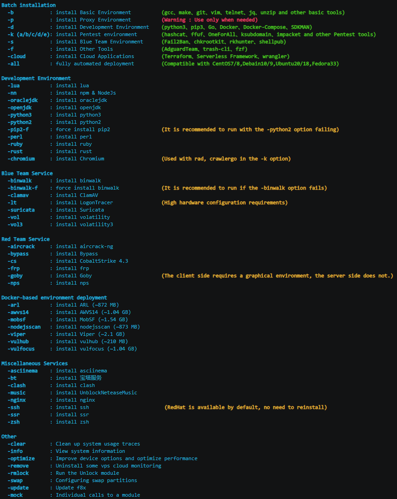

<p align="center">
    
</p

一款红队环境自动化部署工具,支持多种场景,渗透,开发,代理环境,服务可选项等,使用过程中有 bug 或建议请提交 issue.

# 开始

**下载**

访问 [releases](https://github.com/ffffffff0x/f8x/releases) 下载

**使用**
```bash
bash f8x -h
```

**系统依赖**

f8x基本上不需要任何依赖,或者说它就是为了帮助你安装各种依赖而生的😁

---

# 支持选项

目前 f8x 支持以下部署选项

**批量化安装**
- 使用 -b 选项安装基本环境        (gcc、make、git、vim、telnet、jq、unzip 等基本工具)
- 使用 -p 选项安装代理环境        (警告:国外云服务器上不要用,会降速)
- 使用 -d 选项安装开发环境        (python3,pip3,Go,Docker,Docker-Compose)
- 使用 -k 选项安装渗透环境        (hashcat、ffuf、OneForAll、ksubdomain、impacket 等渗透工具)
- 使用 -s 选项加固 linux 服务器   (Fail2Ban)
- 使用 -f 选项安装其他工具        (Bash_Insulter、vlmcsd、AdguardTeam、trash-cli)
- 使用 -h 选项查看帮助文档

**开发可选项**
- 使用 -ssh 选项配置 SSH 环境     (RedHat 系默认可用,无需重复安装)
- 使用 -python2 选项安装 python2 环境
- 使用 -pip2-force 选项强制安装 pip2 环境   (建议在 -python2 选项失败的情况下运行)
- 使用 -ruby 选项安装 ruby 环境
- 使用 -rust 选项安装 rust 环境
- 使用 -oraclejdk 选项安装 oraclejdk 环境
- 使用 -openjdk 选项安装 openjdk 环境
- 使用 -perl 选项安装 perl 环境
- 使用 -nn 选项安装 npm & NodeJs 环境

**安全可选项**
- 使用 -volatility 选项安装 volatility 工具
- 使用 -binwalk 选项安装 binwalk 环境
- 使用 -binwalk-force 选项强制安装 binwalk 环境    (建议在 -binwalk 选项失败的情况下运行)
- 使用 -vulhub 选项安装 vulhub 环境
- 使用 -vulfocus 选项安装 vulfocus 环境
- 使用 -cs 选项部署 CobaltStrike 环境
- 使用 -goby 选项部署 Goby 环境 (需要图形化环境)
- 使用 -awvs13 选项部署 awvs13 环境
- 使用 -arl 选项部署 ARL 环境
- 使用 -frp 选项部署 frp 环境
- 使用 -nps 选项部署 nps 环境
- 使用 -suricata 选项部署 Suricata 环境

**服务可选项**
- 使用 -sharry 选项部署 sharry 文件服务
- 使用 -bt 选项部署宝塔服务

**其他可选项**
- 使用 -ssr 选项部署 ssr 工具
- 使用 -music 选项部署 UnblockNeteaseMusic 服务
- 使用 -optimize 选项改善设备选项,优化性能
- 使用 -info 选项查看系统各项信息
- 使用 -clear 选项清理系统使用痕迹
- 使用 -remove 选项卸载国内vps云监控
- 使用 -rmlock 选项运行除锁模块
- 使用 -asciinema 选项安装 asciinema 截图工具

**一把梭,就是干**
- 使用 -all 选项全自动化部署 (仅兼容国外 vps 服务器, 仅兼容 CentOS7/8,Debain10/9,Ubuntu20/18,Fedora33, 大部分情况下可以一次成功, 做好心理准备)

---

# FAQ

**-p 选项会执行什么**

1. 替换你的 DNS(默认为 223.5.5.5), 如果判断是 debian 系还会帮你安装 resolvconf, 长期修改 DNS
2. 检查基础的编译环境是否安装, 并通过默认的包管理器安装 gcc,make,unzip 这些基本软件
3. 可选的从 https://github.com/rofl0r/proxychains-ng 或 ffffffff0x.com 下载 Proxychains-ng 的源码, 编译安装
4. 要求你修改 /etc/proxychains.conf 文件
5. 修改 pip 代理为 https://mirrors.aliyun.com/pypi/simple/
6. 修改 docker 代理为 https://docker.mirrors.ustc.edu.cn , 并重启 docker 服务

**为啥要从 ffffffff0x.com 或 gitee.com 下载软件压缩包**

1. 下载的都是需要科学上网的东西,所以尽量在不科学上网的情况下,速度较快的下载,所以这个是先有鸡还是先有蛋的问题
2. oracle jdk 安装包我就不用解释了把🤣

---

# 实际效果

**-h 查看帮助**



**-all 全自动化部署**

以 vultr vps 为例,$10/mo 的配置,结果分别如下

| <br><b><p align="center">CentOS 7</p> | <br><b><p align="center">Debian 10</p> |
| - | - |
| <p align="center"><a href="https://asciinema.org/a/385863"></p></a> | <p align="center"><a href="https://asciinema.org/a/385861"></p></a> |
| <br><b><p align="center">Fedora 33</p> | <br><b><p align="center">Ubuntu 20.10</p> |
| <p align="center"><a href="https://asciinema.org/a/385868"></p></a> | <p align="center"><a href="https://asciinema.org/a/385870"></p></a> |

---

# TODO

- [x] 将 xray 社区版集成到 -k 选项中
- [x] 将 masscan 集成到 -k 选项中
- [x] 生成错误日志
- [x] vulfocus 安装选项
- [x] 卸载国内vps云监控
- [x] 参考 oneforall 丰富输出信息
- [x] goby 安装选项
- [x] awvs
- [ ] tomcat 指定版本安装选项
- [ ] weblogic 指定版本安装选项
- [ ] CS插件
- [ ] 修改python2安装方式
- [ ] 完善 -info 选项内容

---

# License

[Apache License 2.0](https://github.com/ffffffff0x/f8x/blob/main/LICENSE)
